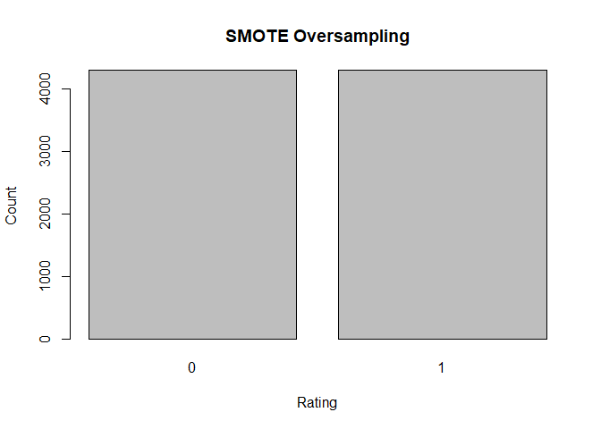
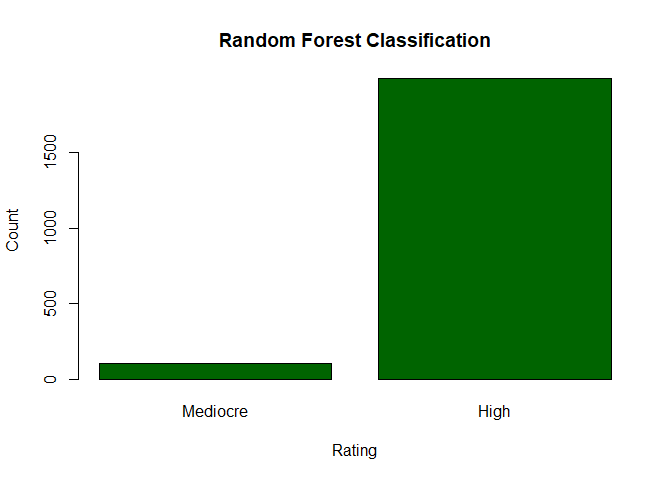
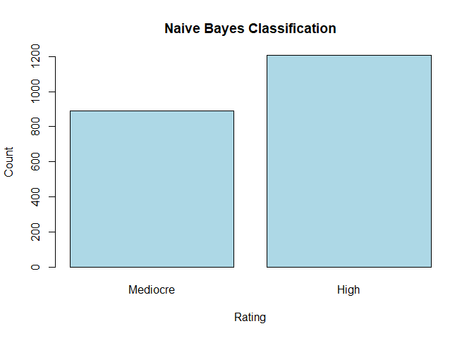

Google Play Store Data Analysis
================
Anthony Le

    ## Loading required package: lattice

    ## Loading required package: grid

    ## Loading required package: ggplot2

    ## randomForest 4.6-14

    ## Type rfNews() to see new features/changes/bug fixes.

    ## 
    ## Attaching package: 'randomForest'

    ## The following object is masked from 'package:ggplot2':
    ## 
    ##     margin

    ## -- Attaching packages ---------------------------------------------------------------------------------------------- tidyverse 1.2.1 --

    ## v tibble  1.4.2     v purrr   0.2.4
    ## v tidyr   0.8.0     v dplyr   0.7.4
    ## v readr   1.1.1     v stringr 1.3.0
    ## v tibble  1.4.2     v forcats 0.3.0

    ## -- Conflicts ------------------------------------------------------------------------------------------------- tidyverse_conflicts() --
    ## x dplyr::combine()       masks randomForest::combine()
    ## x dplyr::filter()        masks stats::filter()
    ## x dplyr::lag()           masks stats::lag()
    ## x purrr::lift()          masks caret::lift()
    ## x randomForest::margin() masks ggplot2::margin()

    ## 
    ## Attaching package: 'lubridate'

    ## The following object is masked from 'package:base':
    ## 
    ##     date

## Data Import

Import Data

``` r
playstore <- read.csv('googleplaystore.csv', header = TRUE)
```

Initial Data

    ## 'data.frame':    10841 obs. of  13 variables:
    ##  $ App           : Factor w/ 9660 levels "- Free Comics - Comic Apps",..: 7229 2563 8998 8113 7294 7125 8171 5589 4948 5826 ...
    ##  $ Category      : Factor w/ 34 levels "1.9","ART_AND_DESIGN",..: 2 2 2 2 2 2 2 2 2 2 ...
    ##  $ Rating        : num  4.1 3.9 4.7 4.5 4.3 4.4 3.8 4.1 4.4 4.7 ...
    ##  $ Reviews       : Factor w/ 6002 levels "0","1","10","100",..: 1183 5924 5681 1947 5924 1310 1464 3385 816 485 ...
    ##  $ Size          : Factor w/ 462 levels "1,000+","1.0M",..: 55 30 368 102 64 222 55 118 146 120 ...
    ##  $ Installs      : Factor w/ 22 levels "0","0+","1,000,000,000+",..: 8 20 13 16 11 17 17 4 4 8 ...
    ##  $ Type          : Factor w/ 4 levels "0","Free","NaN",..: 2 2 2 2 2 2 2 2 2 2 ...
    ##  $ Price         : Factor w/ 93 levels "$0.99","$1.00",..: 92 92 92 92 92 92 92 92 92 92 ...
    ##  $ Content.Rating: Factor w/ 7 levels "","Adults only 18+",..: 3 3 3 6 3 3 3 3 3 3 ...
    ##  $ Genres        : Factor w/ 120 levels "Action","Action;Action & Adventure",..: 10 13 10 10 12 10 10 10 10 12 ...
    ##  $ Last.Updated  : Factor w/ 1378 levels "1.0.19","April 1, 2016",..: 562 482 117 825 757 901 76 726 1317 670 ...
    ##  $ Current.Ver   : Factor w/ 2834 levels "","0.0.0.2","0.0.1",..: 121 1020 466 2827 279 115 279 2393 1457 1431 ...
    ##  $ Android.Ver   : Factor w/ 35 levels "","1.0 and up",..: 17 17 17 20 22 10 17 20 12 17 ...

    ##                                                 App       
    ##  ROBLOX                                           :    9  
    ##  CBS Sports App - Scores, News, Stats & Watch Live:    8  
    ##  8 Ball Pool                                      :    7  
    ##  Candy Crush Saga                                 :    7  
    ##  Duolingo: Learn Languages Free                   :    7  
    ##  ESPN                                             :    7  
    ##  (Other)                                          :10796  
    ##          Category        Rating          Reviews    
    ##  FAMILY      :1972   Min.   : 1.000   0      : 596  
    ##  GAME        :1144   1st Qu.: 4.000   1      : 272  
    ##  TOOLS       : 843   Median : 4.300   2      : 214  
    ##  MEDICAL     : 463   Mean   : 4.193   3      : 175  
    ##  BUSINESS    : 460   3rd Qu.: 4.500   4      : 137  
    ##  PRODUCTIVITY: 424   Max.   :19.000   5      : 108  
    ##  (Other)     :5535   NA's   :1474     (Other):9339  
    ##                  Size             Installs      Type           Price      
    ##  Varies with device:1695   1,000,000+ :1579   0   :    1   0      :10040  
    ##  11M               : 198   10,000,000+:1252   Free:10039   $0.99  :  148  
    ##  12M               : 196   100,000+   :1169   NaN :    1   $2.99  :  129  
    ##  14M               : 194   10,000+    :1054   Paid:  800   $1.99  :   73  
    ##  13M               : 191   1,000+     : 907                $4.99  :   72  
    ##  15M               : 184   5,000,000+ : 752                $3.99  :   63  
    ##  (Other)           :8183   (Other)    :4128                (Other):  316  
    ##          Content.Rating           Genres             Last.Updated 
    ##                 :   1   Tools        : 842   August 3, 2018: 326  
    ##  Adults only 18+:   3   Entertainment: 623   August 2, 2018: 304  
    ##  Everyone       :8714   Education    : 549   July 31, 2018 : 294  
    ##  Everyone 10+   : 414   Medical      : 463   August 1, 2018: 285  
    ##  Mature 17+     : 499   Business     : 460   July 30, 2018 : 211  
    ##  Teen           :1208   Productivity : 424   July 25, 2018 : 164  
    ##  Unrated        :   2   (Other)      :7480   (Other)       :9257  
    ##              Current.Ver               Android.Ver  
    ##  Varies with device:1459   4.1 and up        :2451  
    ##  1.0               : 809   4.0.3 and up      :1501  
    ##  1.1               : 264   4.0 and up        :1375  
    ##  1.2               : 178   Varies with device:1362  
    ##  2.0               : 151   4.4 and up        : 980  
    ##  1.3               : 145   2.3 and up        : 652  
    ##  (Other)           :7835   (Other)           :2520

## Transform Data

1.  Remove columns and duplicated rows

2.  App ratings should have a maximum value of 5

3.  Remove extra characters, convert Size to consistent format, remove
    apps under 1MB, and remove apps with 0 installs

4.  Convert columns to appropriate variable types

<!-- end list -->

    ## Warning: NAs introduced by coercion

    ## 'data.frame':    6998 obs. of  9 variables:
    ##  $ Category      : Factor w/ 33 levels "ART_AND_DESIGN",..: 1 1 1 1 1 1 1 1 1 1 ...
    ##  $ Rating        : num  4.1 3.9 4.7 4.5 4.3 4.4 3.8 4.1 4.4 4.7 ...
    ##  $ Reviews       : num  1183 5924 5681 1947 5924 ...
    ##  $ Size          : num  19 14 8.7 25 2.8 5.6 19 29 33 3.1 ...
    ##  $ Installs      : num  1e+04 5e+05 5e+06 5e+07 1e+05 5e+04 5e+04 1e+06 1e+06 1e+04 ...
    ##  $ Type          : Factor w/ 2 levels "Free","Paid": 1 1 1 1 1 1 1 1 1 1 ...
    ##  $ Price         : num  0 0 0 0 0 0 0 0 0 0 ...
    ##  $ Content.Rating: Factor w/ 7 levels "","Adults only 18+",..: 3 3 3 6 3 3 3 3 3 3 ...
    ##  $ Android.Ver   : Factor w/ 21 levels "1.0","1.5","1.6",..: 11 11 11 13 15 7 11 13 8 11 ...
    ##  - attr(*, "na.action")=Class 'omit'  Named int [1:113] 1385 1386 1387 1427 1430 1452 1457 1468 1470 2075 ...
    ##   .. ..- attr(*, "names")= chr [1:113] "2172" "2173" "2174" "2244" ...

<!-- -->

There is a clear class imbalance, as there are far more apps rated 4.0
and above

## Create Ratings Intervals

Split continuous rating (1.0-5.0) into 2 intervals and convert to
factor

``` r
playstore$Rating <- cut(as.numeric(playstore$Rating), breaks = c(1,4,5), labels = c('Mediocre','High'))
plot(playstore$Rating, main = "Distribution of App Rating, Categorical", xlab = "Rating", ylab = "Count", col="red")
```

<!-- -->

``` r
playstore$Rating = factor(playstore$Rating)
playstore <- na.omit(playstore)
```

## Training/Test Split

Inital training and test split ratio will be
70/30

<!-- -->

    ##      [,1]
    ## [1,]  0.7
    ## [2,]  1.9

## Random Forest

``` r
model1 <- randomForest(Rating ~ ., ps_training)
predict_rf <- predict(model1, ps_test)
plot(predict_rf, main = 'Random Forest Classification', xlab = 'Rating', ylab = 'Count',col = 'darkgreen')
```

<!-- -->

``` r
rf_confusion_matrix <- confusionMatrix(data = predict_rf, reference = ps_test$Rating, positive = 'Mediocre')
print(rf_confusion_matrix)
```

    ## Confusion Matrix and Statistics
    ## 
    ##           Reference
    ## Prediction Mediocre High
    ##   Mediocre       42   62
    ##   High          572 1418
    ##                                          
    ##                Accuracy : 0.6972         
    ##                  95% CI : (0.677, 0.7169)
    ##     No Information Rate : 0.7068         
    ##     P-Value [Acc > NIR] : 0.8375         
    ##                                          
    ##                   Kappa : 0.035          
    ##  Mcnemar's Test P-Value : <2e-16         
    ##                                          
    ##             Sensitivity : 0.06840        
    ##             Specificity : 0.95811        
    ##          Pos Pred Value : 0.40385        
    ##          Neg Pred Value : 0.71256        
    ##              Prevalence : 0.29322        
    ##          Detection Rate : 0.02006        
    ##    Detection Prevalence : 0.04967        
    ##       Balanced Accuracy : 0.51326        
    ##                                          
    ##        'Positive' Class : Mediocre       
    ## 

## Naive Bayes

``` r
model2 <- naiveBayes(Rating ~ .,ps_training)
predict_nb <- predict(model2,ps_test)
plot(predict_nb, main = 'Naive Bayes Classification', xlab = 'Rating', ylab = 'Count',col = 'lightblue')
```

<!-- -->

``` r
nb_confusion_matrix <- confusionMatrix(data = predict_nb, reference = ps_test$Rating, positive = 'Mediocre')
print(nb_confusion_matrix)
```

    ## Confusion Matrix and Statistics
    ## 
    ##           Reference
    ## Prediction Mediocre High
    ##   Mediocre      278  610
    ##   High          336  870
    ##                                           
    ##                Accuracy : 0.5482          
    ##                  95% CI : (0.5266, 0.5697)
    ##     No Information Rate : 0.7068          
    ##     P-Value [Acc > NIR] : 1               
    ##                                           
    ##                   Kappa : 0.0359          
    ##  Mcnemar's Test P-Value : <2e-16          
    ##                                           
    ##             Sensitivity : 0.4528          
    ##             Specificity : 0.5878          
    ##          Pos Pred Value : 0.3131          
    ##          Neg Pred Value : 0.7214          
    ##              Prevalence : 0.2932          
    ##          Detection Rate : 0.1328          
    ##    Detection Prevalence : 0.4241          
    ##       Balanced Accuracy : 0.5203          
    ##                                           
    ##        'Positive' Class : Mediocre        
    ##
