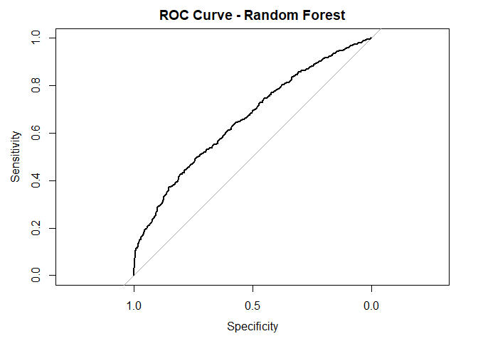

Google Play Store Data Analysis
================
Anthony Le

    ## Loading required package: lattice

    ## Loading required package: grid

    ## Loading required package: ggplot2

    ## -- Attaching packages ---------------------------------------------------------------------------------------------- tidyverse 1.2.1 --

    ## v tibble  1.4.2     v purrr   0.2.4
    ## v tidyr   0.8.0     v dplyr   0.7.4
    ## v readr   1.1.1     v stringr 1.3.0
    ## v tibble  1.4.2     v forcats 0.3.0

    ## -- Conflicts ------------------------------------------------------------------------------------------------- tidyverse_conflicts() --
    ## x dplyr::filter() masks stats::filter()
    ## x dplyr::lag()    masks stats::lag()
    ## x purrr::lift()   masks caret::lift()

    ## 
    ## Attaching package: 'lubridate'

    ## The following object is masked from 'package:base':
    ## 
    ##     date

    ## Type 'citation("pROC")' for a citation.

    ## 
    ## Attaching package: 'pROC'

    ## The following objects are masked from 'package:stats':
    ## 
    ##     cov, smooth, var

## Data Import

Import Data

``` r
playstore <- read.csv('googleplaystore.csv', header = TRUE)
```

Initial Data

    ## 'data.frame':    10841 obs. of  13 variables:
    ##  $ App           : Factor w/ 9660 levels "- Free Comics - Comic Apps",..: 7229 2563 8998 8113 7294 7125 8171 5589 4948 5826 ...
    ##  $ Category      : Factor w/ 34 levels "1.9","ART_AND_DESIGN",..: 2 2 2 2 2 2 2 2 2 2 ...
    ##  $ Rating        : num  4.1 3.9 4.7 4.5 4.3 4.4 3.8 4.1 4.4 4.7 ...
    ##  $ Reviews       : Factor w/ 6002 levels "0","1","10","100",..: 1183 5924 5681 1947 5924 1310 1464 3385 816 485 ...
    ##  $ Size          : Factor w/ 462 levels "1,000+","1.0M",..: 55 30 368 102 64 222 55 118 146 120 ...
    ##  $ Installs      : Factor w/ 22 levels "0","0+","1,000,000,000+",..: 8 20 13 16 11 17 17 4 4 8 ...
    ##  $ Type          : Factor w/ 4 levels "0","Free","NaN",..: 2 2 2 2 2 2 2 2 2 2 ...
    ##  $ Price         : Factor w/ 93 levels "$0.99","$1.00",..: 92 92 92 92 92 92 92 92 92 92 ...
    ##  $ Content.Rating: Factor w/ 7 levels "","Adults only 18+",..: 3 3 3 6 3 3 3 3 3 3 ...
    ##  $ Genres        : Factor w/ 120 levels "Action","Action;Action & Adventure",..: 10 13 10 10 12 10 10 10 10 12 ...
    ##  $ Last.Updated  : Factor w/ 1378 levels "1.0.19","April 1, 2016",..: 562 482 117 825 757 901 76 726 1317 670 ...
    ##  $ Current.Ver   : Factor w/ 2834 levels "","0.0.0.2","0.0.1",..: 121 1020 466 2827 279 115 279 2393 1457 1431 ...
    ##  $ Android.Ver   : Factor w/ 35 levels "","1.0 and up",..: 17 17 17 20 22 10 17 20 12 17 ...

    ##                                                 App       
    ##  ROBLOX                                           :    9  
    ##  CBS Sports App - Scores, News, Stats & Watch Live:    8  
    ##  8 Ball Pool                                      :    7  
    ##  Candy Crush Saga                                 :    7  
    ##  Duolingo: Learn Languages Free                   :    7  
    ##  ESPN                                             :    7  
    ##  (Other)                                          :10796  
    ##          Category        Rating          Reviews    
    ##  FAMILY      :1972   Min.   : 1.000   0      : 596  
    ##  GAME        :1144   1st Qu.: 4.000   1      : 272  
    ##  TOOLS       : 843   Median : 4.300   2      : 214  
    ##  MEDICAL     : 463   Mean   : 4.193   3      : 175  
    ##  BUSINESS    : 460   3rd Qu.: 4.500   4      : 137  
    ##  PRODUCTIVITY: 424   Max.   :19.000   5      : 108  
    ##  (Other)     :5535   NA's   :1474     (Other):9339  
    ##                  Size             Installs      Type           Price      
    ##  Varies with device:1695   1,000,000+ :1579   0   :    1   0      :10040  
    ##  11M               : 198   10,000,000+:1252   Free:10039   $0.99  :  148  
    ##  12M               : 196   100,000+   :1169   NaN :    1   $2.99  :  129  
    ##  14M               : 194   10,000+    :1054   Paid:  800   $1.99  :   73  
    ##  13M               : 191   1,000+     : 907                $4.99  :   72  
    ##  15M               : 184   5,000,000+ : 752                $3.99  :   63  
    ##  (Other)           :8183   (Other)    :4128                (Other):  316  
    ##          Content.Rating           Genres             Last.Updated 
    ##                 :   1   Tools        : 842   August 3, 2018: 326  
    ##  Adults only 18+:   3   Entertainment: 623   August 2, 2018: 304  
    ##  Everyone       :8714   Education    : 549   July 31, 2018 : 294  
    ##  Everyone 10+   : 414   Medical      : 463   August 1, 2018: 285  
    ##  Mature 17+     : 499   Business     : 460   July 30, 2018 : 211  
    ##  Teen           :1208   Productivity : 424   July 25, 2018 : 164  
    ##  Unrated        :   2   (Other)      :7480   (Other)       :9257  
    ##              Current.Ver               Android.Ver  
    ##  Varies with device:1459   4.1 and up        :2451  
    ##  1.0               : 809   4.0.3 and up      :1501  
    ##  1.1               : 264   4.0 and up        :1375  
    ##  1.2               : 178   Varies with device:1362  
    ##  2.0               : 151   4.4 and up        : 980  
    ##  1.3               : 145   2.3 and up        : 652  
    ##  (Other)           :7835   (Other)           :2520

## Transform Data

1.  Remove columns and duplicated rows

2.  Remove extra characters and convert attributes to consistent numeric
    format

3.  Convert columns to appropriate variable types

<!-- end list -->

    ## Warning: NAs introduced by coercion

    ## 'data.frame':    6998 obs. of  9 variables:
    ##  $ Category      : Factor w/ 33 levels "ART_AND_DESIGN",..: 1 1 1 1 1 1 1 1 1 1 ...
    ##  $ Rating        : num  4.1 3.9 4.7 4.5 4.3 4.4 3.8 4.1 4.4 4.7 ...
    ##  $ Reviews       : num  1183 5924 5681 1947 5924 ...
    ##  $ Size          : num  19 14 8.7 25 2.8 5.6 19 29 33 3.1 ...
    ##  $ Installs      : num  1e+04 5e+05 5e+06 5e+07 1e+05 5e+04 5e+04 1e+06 1e+06 1e+04 ...
    ##  $ Type          : Factor w/ 2 levels "Free","Paid": 1 1 1 1 1 1 1 1 1 1 ...
    ##  $ Price         : num  0 0 0 0 0 0 0 0 0 0 ...
    ##  $ Content.Rating: Factor w/ 7 levels "","Adults only 18+",..: 3 3 3 6 3 3 3 3 3 3 ...
    ##  $ Android.Ver   : Factor w/ 21 levels "1.0","1.5","1.6",..: 11 11 11 13 15 7 11 13 8 11 ...
    ##  - attr(*, "na.action")=Class 'omit'  Named int [1:113] 1385 1386 1387 1427 1430 1452 1457 1468 1470 2075 ...
    ##   .. ..- attr(*, "names")= chr [1:113] "2172" "2173" "2174" "2244" ...

<!-- -->

There is a clear class imbalance, as there are far more apps rated 4.0
and above

## Create Ratings Intervals

Split continuous rating (1.0-5.0) into 2 intervals and convert to
factor

``` r
playstore$Rating <- cut(as.numeric(playstore$Rating), breaks = c(1,4,5), labels = c('0','1'))
plot(playstore$Rating, main = "Distribution of App Rating, Categorical", xlab = "Rating", ylab = "Count", col="red")
```

<!-- -->

``` r
playstore$Rating = factor(playstore$Rating)
playstore <- na.omit(playstore)
```

## Oversampling

<!-- -->

    ##      [,1]
    ## [1,]  0.7
    ## [2,]  1.9

## Random Forest

``` r
model_rf <- train(ps_training[,-2],ps_training$Rating,method = "rf", trControl = trainControl(method="cv",number = 11,savePredictions = TRUE))
```

## Naive Bayes

``` r
model_nb <- train(ps_training[,-2], ps_training$Rating,method = "naive_bayes", trControl = trainControl(method="cv",number = 11,savePredictions = TRUE))
```

## Logistic Regression

``` r
model_lr <- train(ps_training[,-2], ps_training$Rating, method = "glm", trControl = trainControl(method = "cv",number = 11,savePredictions = TRUE))
```

    ## Warning: glm.fit: fitted probabilities numerically 0 or 1 occurred

## Confusion Matrices

``` r
confusionMatrix_rf <- confusionMatrix(model_rf)
confusionMatrix_rf 
```

    ## Cross-Validated (11 fold) Confusion Matrix 
    ## 
    ## (entries are percentual average cell counts across resamples)
    ##  
    ##           Reference
    ## Prediction    0    1
    ##          0 38.1  2.7
    ##          1 11.9 47.3
    ##                             
    ##  Accuracy (average) : 0.8538

``` r
confusionMatrix_nb <- confusionMatrix(model_nb)
confusionMatrix_nb 
```

    ## Cross-Validated (11 fold) Confusion Matrix 
    ## 
    ## (entries are percentual average cell counts across resamples)
    ##  
    ##           Reference
    ## Prediction    0    1
    ##          0 29.4 10.6
    ##          1 20.6 39.4
    ##                             
    ##  Accuracy (average) : 0.6881

``` r
confusionMatrix_lr <- confusionMatrix(model_lr)
confusionMatrix_lr 
```

    ## Cross-Validated (11 fold) Confusion Matrix 
    ## 
    ## (entries are percentual average cell counts across resamples)
    ##  
    ##           Reference
    ## Prediction    0    1
    ##          0 29.1 10.7
    ##          1 20.9 39.3
    ##                             
    ##  Accuracy (average) : 0.6841

## ROC Curves and AUC

``` r
rf_predict <- predict(model_rf, ps_test, type = "prob")
rf_roc <- roc(ps_test$Rating, rf_predict$`1`)
plot.roc(rf_roc, main = "ROC Curve - Random Forest")
```

<!-- -->

``` r
auc(rf_roc)
```

    ## Area under the curve: 0.6593

``` r
nb_predict <- predict(model_nb, ps_test, type = "prob")
nb_roc <- roc(ps_test$Rating, nb_predict$`1`)
plot.roc(nb_roc, main = "ROC Curve - Naive Bayes")
```

<!-- -->

``` r
auc(nb_roc)
```

    ## Area under the curve: 0.5745

``` r
lr_predict <- predict(model_lr, ps_test, type = "prob")
lr_roc <- roc(ps_test$Rating, lr_predict$`1`)
plot.roc(lr_roc, main = "ROC Curve - Logistic Regression")
```

<!-- -->

``` r
auc(lr_roc)
```

    ## Area under the curve: 0.5832

Based on confusion matrix and ROC/AUC metrics, Random Forest is the best
performing algorithm out of the 3 examined.

## Feature Importance

``` r
rf_importance <- varImp(model_rf)
plot(rf_importance, main = "Attribute Importance - Random Forest")
```

<!-- -->

``` r
nb_importance <- varImp(model_nb)
plot(nb_importance, main = "Attribute Importance - Naive Bayes")
```

<!-- -->

``` r
lr_importance <- varImp(model_lr)
plot(lr_importance, top = 10, main = "Attribute Importance - Logistic Regression")
```

<!-- -->
